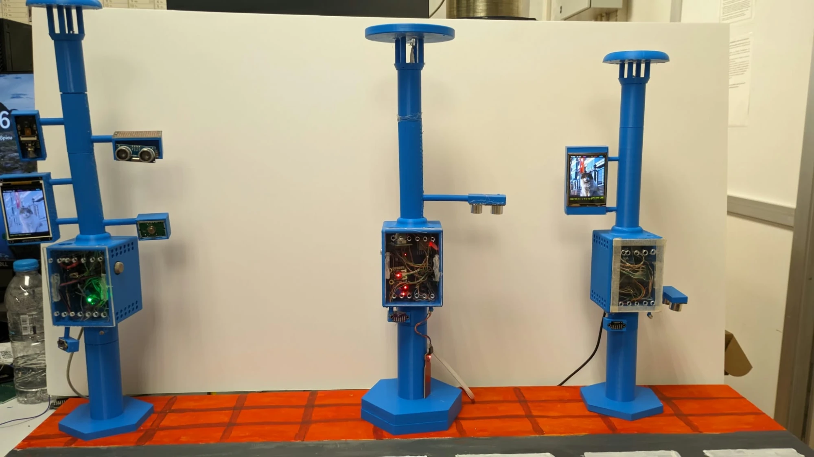
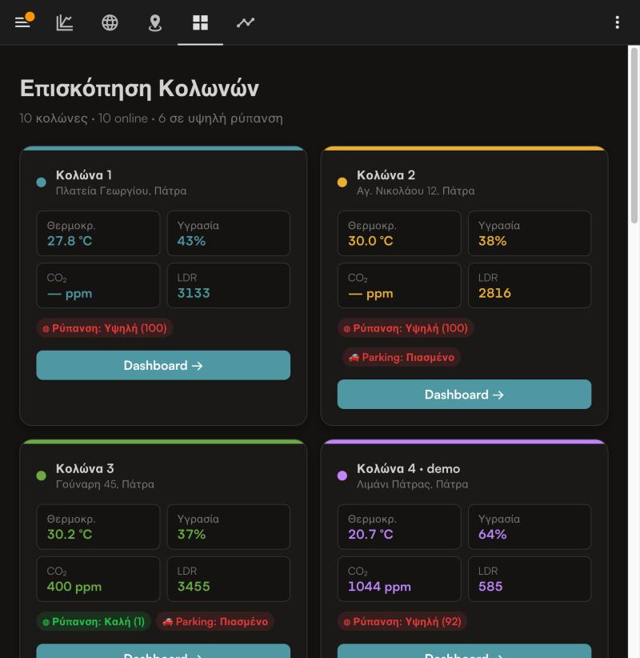
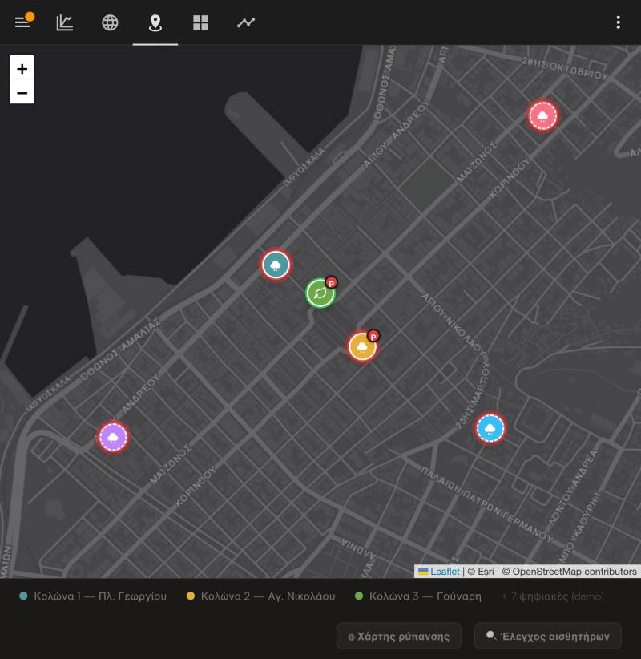
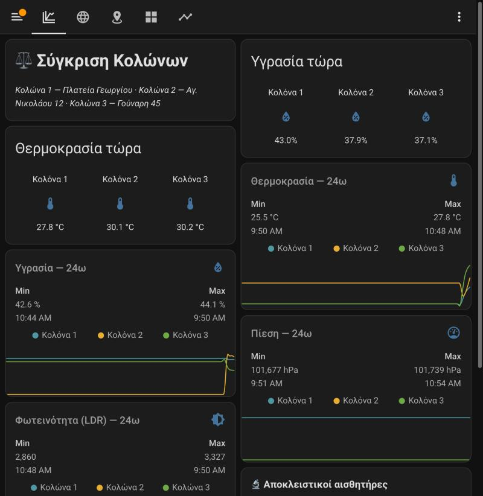
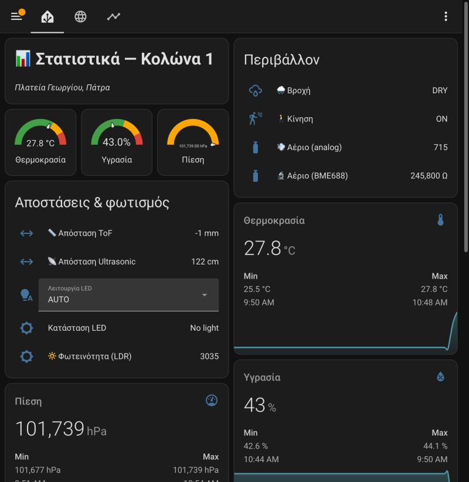
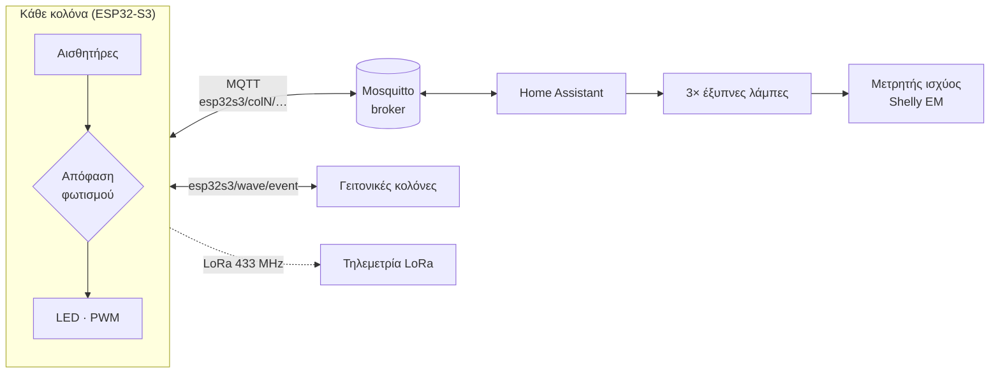

# Έξυπνες Κολόνες Αστικού Φωτισμού — Προσαρμοστικός φωτισμός με ESP32-S3, MQTT & Home Assistant

[🇬🇧 English](README.md) · 🇬🇷 Ελληνικά

> Διπλωματική εργασία: τρεις διασυνδεδεμένες έξυπνες κολόνες φωτισμού που μετρούν το περιβάλλον, ανιχνεύουν τους διερχόμενους και φωτίζουν τον δρόμο *μπροστά* τους — με μετρημένη εξοικονόμηση ενέργειας **17,8 %** σε σχέση με τον συμβατικό φωτισμό πλήρους έντασης.



---

## Επισκόπηση

Κάθε κολόνα είναι τρισδιάστατα εκτυπωμένη μακέτα με μικροελεγκτή **ESP32-S3**, συστοιχία αισθητήρων περιβάλλοντος, αισθητήρα παρουσίας laser (time-of-flight) και φωτιστικό με ρύθμιση έντασης. Οι κολόνες επικοινωνούν μεταξύ τους και με τον εξυπηρετητή **Home Assistant** μέσω **MQTT/WiFi**, ενώ εκπέμπουν και τηλεμετρία μέσω **LoRa (433 MHz)**.

Η απόφαση φωτισμού λαμβάνεται **τοπικά σε κάθε κολόνα** — το MQTT χρησιμεύει για τηλεμετρία, απομακρυσμένο έλεγχο και συντονισμό των γειτονικών κολόνων. Όταν μια κολόνα ανιχνεύσει κάποιον, οι γείτονές της προανάβουν: το φως «ταξιδεύει» μπροστά από τον πεζό σαν κύμα.

| Κολόνα | Θέση | Οθόνη | Αισθητήρες |
|--------|------|-------|------------|
| **COL1** | Άκρο δρόμου (1) | ILI9341 240×320 | BH1750, LTR390-UV, BME688, VL53L0X, HC-SR04, PIR, βροχής, ποιότητας αέρα, αερίου, LDR |
| **COL2** | Ενδιάμεση (2) | — | VL53L0X, BME280, SGP30, HC-SR04, στάθμης νερού, αερίου, φλόγας, ήχου, 2× LDR |
| **COL3** | Άκρο δρόμου (3) | ILI9341 240×320 | BME680, SGP30, VL53L0X, HC-SR04, 2× LDR |
| **Κάμερα** | — | — | ESP-EYE, ροή MJPEG στο Home Assistant |

Οι δύο κολόνες με οθόνη δείχνουν κυλιόμενο banner και slideshow εικόνων που κατεβάζουν από το Home Assistant.

## Dashboard στο Home Assistant

| Επισκόπηση όλων των κολόνων | Χάρτης (Πάτρα) |
|---|---|
|  |  |
| **Σύγκριση κολόνων** | **Κολόνα 1 — ζωντανές μετρήσεις** |
|  |  |

## Αρχιτεκτονική



### Στάθμες φωτισμού (λειτουργία AUTO)

| Κατάσταση | Φωτεινότητα |
|-----------|-------------|
| Μέρα | 0 % |
| Νύχτα, κανείς | 50 % |
| **Γειτονική** κολόνα ανίχνευσε (κύμα) | 78 % |
| **Αυτή** η κολόνα ανίχνευσε | 100 % |

Η φωτεινότητα αλλάζει ομαλά (βήματα 20 ms)· η εναλλαγή μέρας/νύχτας γίνεται με υστέρηση δύο κατωφλίων (τύπου Schmitt trigger) ώστε να μην τρεμοπαίζει.

## Βασικά τεχνικά σημεία

- **Αποκεντρωμένος συντονισμός** — η κολόνα που ανιχνεύει δημοσιεύει τη θέση της στο κοινό θέμα `esp32s3/wave/event`· κάθε παραλήπτης αποφασίζει μόνος του αν ο αποστολέας είναι άμεσος γείτονας. Δεν υπάρχει κεντρικός ελεγκτής· η συμπεριφορά του δρόμου προκύπτει από τοπικούς κανόνες.
- **Κατάσταση vs συμβάν στο MQTT** — οι μετρήσεις είναι *retained* (το Home Assistant δείχνει σωστές τιμές αμέσως μετά από επανεκκίνηση)· το συμβάν του κύματος *όχι*, ώστε οι κολόνες να μην ανάβουν για μια διέλευση που έγινε ώρες πριν.
- **Last Will & Testament** — κάθε κολόνα δηλώνει `offline` ως LWT, οπότε το Home Assistant μαθαίνει για βλάβη χωρίς περιοδικό έλεγχο.
- **Δημοσίευση μόνο σε μεταβολή, με νεκρή ζώνη + παλμό 10 s** — ~90 % λιγότερη κίνηση MQTT χωρίς απώλεια πληροφορίας.
- **Τίποτα δεν μπλοκάρει** — αναγνώσεις αισθητήρων (π.χ. η μετατροπή 300 ms του BME688), επανασύνδεση WiFi/MQTT και λήψη εικόνων δεν παγώνουν ποτέ τον βρόχο.
- **Φιλτράρισμα θορύβου** — η ανίχνευση απαιτεί δύο διαδοχικές μετρήσεις laser < 200 mm, οι τιμές εκτός 30–1800 mm απορρίπτονται και ελέγχεται ο δείκτης ποιότητας του VL53L0X.
- **Σύντηξη αισθητήρων** — οι τιμές eCO₂/TVOC του SGP30 διορθώνονται με την απόλυτη υγρασία που υπολογίζεται από τον BME280 (εξίσωση Magnus).
- **Δίχτυ ασφαλείας** — watchdog (επανεκκίνηση αν το `loop()` κολλήσει 30 s), φρουρός μνήμης, προγραμματισμένη επανεκκίνηση ανά 12 h και αναφορά της αιτίας του τελευταίου reboot κατά την εκκίνηση.
- **Slideshow χωρίς διαρροές μνήμης** — σταθεροί πίνακες `char` αντί για `String` και buffer εικόνας που δεσμεύεται μία φορά στο boot — αυτό έλυσε τα κρασαρίσματα από κατακερματισμό μνήμης μετά από ώρες λειτουργίας.
- **Κοινή βιβλιοθήκη (DRY)** — η λογική που είναι κοινή και στις τρεις κολόνες υπάρχει μία φορά στη [`KolonaCore`](libraries/KolonaCore/src)· κάθε sketch κρατά μόνο τα pins, τα topics και τους αισθητήρες του (≈50 % μικρότερα sketches).
- **Επιλογή οθόνης κατά τη μεταγλώττιση** — οι δύο οθόνες θέλουν διαφορετικό setup του TFT_eSPI· μια μεταβλητή στο `build_opt.h` επιλέγει αυτόματα το σωστό, και έλεγχος κατά τη μεταγλώττιση σταματά το build με σαφές μήνυμα αν χρησιμοποιηθεί λάθος setup.

## Πείραμα εξοικονόμησης ενέργειας

Ένας μετρητής Shelly EM με αμπεροτσιμπίδα μετρά αποκλειστικά τα τρία φωτιστικά. Αυτοματισμός του Home Assistant εναλλάσσει δύο σενάρια και χωρίζει την ενέργεια ανά σενάριο με tariffs του `utility_meter`.

| | Συμβατικό (baseline) | Προσαρμοστικό (adaptive) |
|---|---|---|
| Χωρίς παρουσία | 100 % | 75 % |
| Ανιχνεύει γείτονας | 100 % | 88 % (προ-άναμμα) |
| Ανιχνεύει η ίδια | 100 % | 100 % |

Μετρημένη ισχύς: αναμονή 3,19 W · 75 % → 16,4 W · 88 % → 19,1 W · 100 % → 21,0 W (σχεδόν γραμμική σχέση φωτεινότητας–ισχύος).

**Φάση Α (χωρίς κυκλοφορία), 14–15/09/2026**

| Σενάριο | Ενέργεια | Διάρκεια | Μέση ισχύς |
|---|---|---|---|
| Συμβατικό 100 % | 0,226 kWh | 12,55 h | 18,0 W |
| Προσαρμοστικό 75 % | 0,147 kWh | 9,91 h | 14,8 W |

➡️ **Εξοικονόμηση 17,8 %** χωρίς καμία διέλευση (σύγκριση σε μέση ισχύ, επειδή οι διάρκειες διαφέρουν).

Με αφίξεις κατά Poisson, η προβλεπόμενη εξοικονόμηση πέφτει από ≈16 % σε ήσυχο δρόμο (5 διελεύσεις/ώρα) σε ≈2 % σε λεωφόρο (120 διελεύσεις/ώρα): ο προσαρμοστικός φωτισμός αποδίδει περισσότερο σε δρόμους χαμηλής κυκλοφορίας.

## Δομή του repository

```
firmware/
  col1/            Κολόνα 1 (+ build_opt.h — επιλέγει το setup οθόνης, μην το σβήσεις)
  col2/            Κολόνα 2
  col3/            Κολόνα 3
  camera/          Κάμερα ESP-EYE (ροή MJPEG)
  display_test/    Αυτόνομο τεστ οθόνης
  secrets.example.h  Πρότυπο για τους κωδικούς WiFi/MQTT
libraries/
  KolonaCore/      Κοινή βιβλιοθήκη: ασφάλεια, ανίχνευση, LED/κύμα, δίκτυο, δημοσίευση, οθόνη
  TFT_eSPI_setup/  Αρχεία ρύθμισης οθόνης για τη βιβλιοθήκη TFT_eSPI
home_assistant/    Αυτοματισμός, πακέτο πειράματος ενέργειας, κάρτες dashboard (YAML)
  www/             Δικό μου dashboard σε HTML/JS (ζωντανός χάρτης, σύγκριση, ιστορικό — Leaflet + Chart.js)
docs/              Κείμενα διπλωματικής (PDF) και φωτογραφίες
tools/             Script που παράγει το PDF σύγκρισης με τη βιβλιογραφία
```

## Εγκατάσταση

**Υλικό:** πλακέτες ESP32-S3 (κολόνες), ESP-EYE (κάμερα), οι αισθητήρες του πίνακα, οθόνες ILI9341, modules LoRa SX1278.

1. **Arduino core:** εγκατάσταση *esp32 by Espressif* (δοκιμασμένο με 3.3.10), πλακέτα `ESP32S3 Dev Module`.
2. **Βιβλιοθήκες** (Library Manager): PubSubClient, TFT_eSPI, TJpg_Decoder, LoRa (Sandeep Mistry), Adafruit VL53L0X, Adafruit BME280, Adafruit BME680, Adafruit SGP30, BH1750, DFRobot_LTR390UV, DFRobot_BME68x.
3. **Κοινή βιβλιοθήκη:** αντέγραψε το `libraries/KolonaCore` στον φάκελο `Arduino/libraries/`.
4. **Ρύθμιση οθόνης:** αντέγραψε τα τρία αρχεία του `libraries/TFT_eSPI_setup/` μέσα στο `Arduino/libraries/TFT_eSPI/` (αντικαθιστώντας τα αρχικά).
5. **Κωδικοί:** αντέγραψε το `firmware/secrets.example.h` ως `secrets.h` σε κάθε φάκελο sketch και συμπλήρωσε τα στοιχεία WiFi / MQTT.
6. **Μεταγλώττιση & ανέβασμα**, π.χ.:
   ```bash
   arduino-cli compile -b esp32:esp32:esp32s3 firmware/col1
   ```
7. **Home Assistant:** οδηγίες στα σχόλια στην αρχή κάθε αρχείου του [`home_assistant/`](home_assistant) — το πακέτο ενέργειας μπαίνει στο `config/packages/`, ο αυτοματισμός και οι κάρτες επικολλώνται από το UI (το διάγραμμα θέλει το *ApexCharts Card* από το HACS).
8. **Dashboard HTML (προαιρετικό):** αντέγραψε το `home_assistant/www/dashboard_kolones.html` στο `config/www/`, φτιάξε ένα long-lived access token (Προφίλ → Security) και βάλ' το στη θέση του `YOUR_LONG_LIVED_TOKEN_HERE`. Ανοίγει στο `http://<ha>:8123/local/dashboard_kolones.html` ή μέσα σε dashboard με κάρτα *iframe*. ⚠️ Τα αρχεία του `www/` σερβίρονται χωρίς σύνδεση — μην εκθέτεις στο internet το αντίγραφο με το πραγματικό token.

> **Σημείωση:** στα αρχεία YAML του Home Assistant, αντικατέστησε το `shellyem_xxxxxxxxxxxx` με το entity ID του δικού σου Shelly EM.

## Τεκμηρίωση

- [Τεχνική τεκμηρίωση λογισμικού](docs/code-documentation_el.pdf) — αντιστοίχιση κώδικα σε κεφάλαια, αισθητήρες, πρωτόκολλο MQTT, πείραμα ενέργειας, πλήρης κατάλογος topics.
- [Σύγκριση με τη βιβλιογραφία](docs/literature-comparison_el.pdf)

## Συγγραφέας

**Gyurika** ([@gyurika12](https://github.com/gyurika12)) — Διπλωματική εργασία, 2026.
