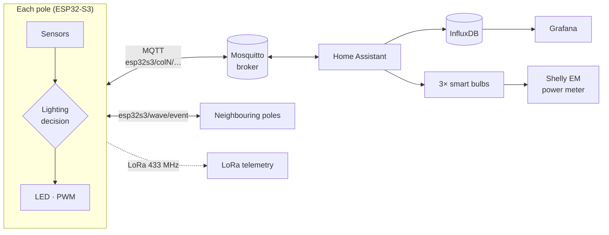

# Smart City Street-Light Poles — Adaptive Lighting with ESP32-S3, MQTT & Home Assistant

🇬🇧 English · [🇬🇷 Ελληνικά](README.el.md)

> Diploma thesis project: three interconnected smart street-light poles that sense their environment, detect passers-by, and light the street *ahead* of them — measured to save **17.8 %** energy compared with conventional full-brightness lighting.


---

## Overview

Each pole is a 3D-printed scale model carrying an **ESP32-S3** microcontroller, an array of environmental sensors, a laser time-of-flight presence sensor and a dimmable light. The poles talk to each other and to a **Home Assistant** server over **MQTT/WiFi**, and also transmit telemetry over **LoRa (433 MHz)**.

The lighting decision is made **locally on each pole** — MQTT is used for telemetry, remote control, and for coordinating neighbouring poles. When a pole detects someone, its neighbours pre-light: the light "travels" in front of the pedestrian like a wave.

| Pole | Position | Display | Sensors |
|------|----------|---------|---------|
| **COL1** | Street end (1) | ILI9341 240×320 | BH1750, LTR390-UV, BME688, VL53L0X, HC-SR04, PIR, rain, air quality, gas, LDR |
| **COL2** | Middle (2) | — | VL53L0X, BME280, SGP30, HC-SR04, water level, gas, flame, sound, 2× LDR |
| **COL3** | Street end (3) | ILI9341 240×320 | BME680, SGP30, VL53L0X, HC-SR04, 2× LDR |
| **Camera** | — | — | ESP-EYE MJPEG stream into Home Assistant |

The two poles with displays show a scrolling banner and an image slideshow fetched from Home Assistant.

## Home Assistant dashboard

| Overview of all poles | Map (Patras) |
|---|---|
|  |  |
| **Pole comparison** | **Pole 1 — live sensors** |
|  |  |

## Architecture



### Lighting levels (AUTO mode)

| State | Brightness |
|-------|-----------|
| Day | 0 % |
| Night, nobody around | 50 % |
| A **neighbour** detected someone (wave) | 78 % |
| **This** pole detected someone | 100 % |

Brightness ramps smoothly (20 ms steps); day/night switching uses a two-threshold hysteresis (Schmitt-trigger style) to avoid flicker.

## Key engineering points

- **Decentralised coordination** — a detecting pole publishes its index on a shared topic `esp32s3/wave/event`; each receiver decides for itself whether the sender is an immediate neighbour. No central controller; the street-wide behaviour emerges from local rules.
- **State vs. event in MQTT** — measurements are *retained* (Home Assistant shows correct values immediately after a restart); the wave event is *not* retained, so poles don't light up for a passage that happened hours ago.
- **Last Will & Testament** — each pole registers `offline` as its LWT, so Home Assistant learns of a failure without polling.
- **Publish-on-change with deadband + 10 s heartbeat** — ~90 % less MQTT traffic with no loss of information.
- **Non-blocking everything** — sensor reads (e.g. BME688's 300 ms conversion), WiFi/MQTT reconnection and image downloads never stall the loop.
- **Noise filtering** — a detection requires two consecutive laser readings < 200 mm, readings outside 30–1800 mm are rejected, and VL53L0X range status is checked.
- **Sensor fusion** — SGP30 eCO₂/TVOC are humidity-compensated using absolute humidity computed from the BME280 (Magnus equation).
- **Reliability safety net** — watchdog task (reboot if `loop()` stalls 30 s), heap guard, scheduled 12 h reboot, and the cause of the last reboot printed at boot.
- **Memory-safe slideshow** — fixed `char` buffers instead of `String`, and the JPEG buffer allocated once at boot — this fixed crashes caused by heap fragmentation after hours of operation.
- **Shared library (DRY)** — the logic common to all poles lives once in [`KolonaCore`](libraries/KolonaCore/src); each sketch keeps only its pins, topics and sensors (≈50 % smaller sketches).
- **Compile-time display selection** — the two displays need different TFT_eSPI setups; a `build_opt.h` flag selects the right one automatically, and a compile-time check stops the build with a clear message if the wrong setup is used.

## Grafana & InfluxDB

All sensor values are stored long-term in **InfluxDB** by the Home Assistant `influxdb` integration and visualised in **Grafana** (both run as Home Assistant add-ons). The dashboard compares the three poles side by side and has one row per pole.


See [`grafana/`](grafana) for the importable dashboard and [`home_assistant/influxdb.yaml`](home_assistant/influxdb.yaml) for the integration config.

## Energy-saving experiment

A Shelly EM clamp meter measures only the three lights. A Home Assistant automation alternates between two scenarios and splits the energy per scenario with `utility_meter` tariffs.

| | Baseline | Adaptive |
|---|---|---|
| Nobody around | 100 % | 75 % |
| Neighbour detects | 100 % | 88 % (pre-light) |
| Pole itself detects | 100 % | 100 % |

Measured power: standby 3.19 W · 75 % → 16.4 W · 88 % → 19.1 W · 100 % → 21.0 W (brightness-to-power relation is almost linear).

**Phase A (no traffic), 14–15/09/2026**

| Scenario | Energy | Duration | Mean power |
|---|---|---|---|
| Baseline 100 % | 0.226 kWh | 12.55 h | 18.0 W |
| Adaptive 75 % | 0.147 kWh | 9.91 h | 14.8 W |

➡️ **17.8 % saving** with zero traffic (compared on mean power, since durations differ).

Modelling arrivals as a Poisson process, the predicted saving falls from ≈16 % on a quiet street (5 passes/h) to ≈2 % on an avenue (120 passes/h): adaptive lighting pays off most on low-traffic streets.

## Repository structure

```
firmware/
  col1/            Pole 1 sketch (+ build_opt.h — selects its display setup, do not delete)
  col2/            Pole 2 sketch
  col3/            Pole 3 sketch
  camera/          ESP-EYE MJPEG streaming server
  display_test/    Stand-alone TFT diagnostic
  secrets.example.h  Template for WiFi/MQTT credentials
libraries/
  KolonaCore/      Shared library: safety, detection, LED/wave, network, publisher, display
  TFT_eSPI_setup/  Display setup files for the TFT_eSPI library
home_assistant/    Automation, energy-experiment package and dashboard cards (YAML)
  www/             Custom HTML/JS dashboard (live map, comparison, history — Leaflet + Chart.js)
docs/              Thesis documents (Greek, PDF) and photos
grafana/           Grafana dashboard (JSON) + generator script
tools/             PDF generator, token-removal patch for the HTML dashboard
```

## Getting started

**Hardware:** ESP32-S3 dev boards (poles), ESP-EYE (camera), the sensors listed above, ILI9341 displays, SX1278 LoRa modules.

1. **Arduino core:** install *esp32 by Espressif* (tested with 3.3.10), board `ESP32S3 Dev Module`.
2. **Libraries** (Library Manager): PubSubClient, TFT_eSPI, TJpg_Decoder, LoRa (Sandeep Mistry), Adafruit VL53L0X, Adafruit BME280, Adafruit BME680, Adafruit SGP30, BH1750, DFRobot_LTR390UV, DFRobot_BME68x.
3. **Shared library:** copy `libraries/KolonaCore` into your `Arduino/libraries/` folder.
4. **Display setup:** copy the three files from `libraries/TFT_eSPI_setup/` into `Arduino/libraries/TFT_eSPI/` (overwriting the originals).
5. **Credentials:** copy `firmware/secrets.example.h` as `secrets.h` into each sketch folder and fill in your WiFi / MQTT details.
6. **Compile & upload**, e.g.:
   ```bash
   arduino-cli compile -b esp32:esp32:esp32s3 firmware/col1
   ```
7. **Home Assistant:** see the comments at the top of each file in [`home_assistant/`](home_assistant) — the energy package goes in `config/packages/`, the automation and dashboard cards are pasted via the UI (the chart needs *ApexCharts Card* from HACS).
8. **Custom HTML dashboard (optional):** copy `home_assistant/www/dashboard_kolones.html` to `config/www/`, and open it at `http://<ha>:8123/local/dashboard_kolones.html` or embed it in a dashboard with an *iframe* card. No token is stored in the file: the page uses your current Home Assistant login (same origin) and refreshes it automatically.

> **Note:** in the Home Assistant YAML files, replace `shellyem_xxxxxxxxxxxx` with the entity ID of your own Shelly EM.

## Documentation

- [Software technical documentation (Greek)](docs/code-documentation_el.pdf) — code-to-chapter map, sensors, MQTT protocol, energy experiment, full topic list.
- [Comparison with the literature (Greek)](docs/literature-comparison_el.pdf)

## Author

**Gyurika** ([@gyurika12](https://github.com/gyurika12)) — Diploma thesis, 2026.
