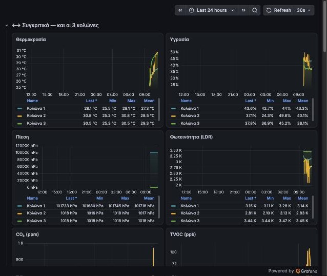
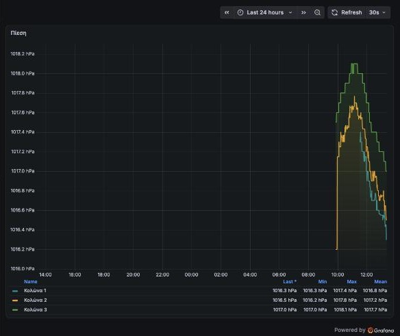

# Grafana

🇬🇧 Dashboard for the three poles, reading from **InfluxDB 1.x** (filled by Home Assistant — see [`home_assistant/influxdb.yaml`](../home_assistant/influxdb.yaml)).
🇬🇷 Dashboard για τις τρεις κολόνες, με δεδομένα από **InfluxDB 1.x** (τα γράφει το Home Assistant — δες [`home_assistant/influxdb.yaml`](../home_assistant/influxdb.yaml)).

**Pressure / Πίεση** — only valid values (900–1100 hPa) are queried, so the axis auto-scales and small changes are visible.
Μόνο έγκυρες τιμές (900–1100 hPa), ώστε ο άξονας να «σφίγγει» και να φαίνονται οι μικρές μεταβολές.

| File | |
|---|---|
| `dashboards/kolones-patras.json` | Ready to import / Έτοιμο για import — 29 panels: comparison of all poles + one row per pole |
| `build_dashboard.py` | Generates the JSON above / Παράγει το παραπάνω JSON (`python3 grafana/build_dashboard.py`) |

**Import:** Grafana → Dashboards → New → Import → upload `kolones-patras.json` → choose your InfluxDB data source.
**Data source:** type *InfluxDB*, query language *InfluxQL*, URL `http://a0d7b954-influxdb:8086`, database `kolones`.
